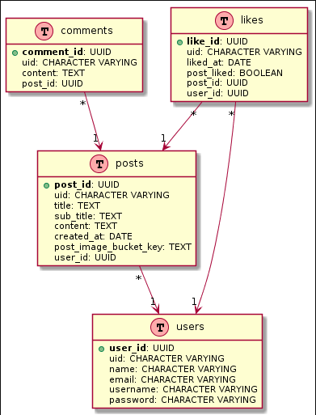

<p align="center"></p>

<p align="center">
<a href="https://img.shields.io/circleci/build/github/rostgoat/ea-blog-api/master" target="_blank"></a>
<a href="https://img.shields.io/npm/v/npm" target="_blank"></a>
<a href="https://img.shields.io/badge/license-MIT-blue.svg" target="_blank"></a>
</p>


# Overview

Game Bible is a video game blog application created to experiment with various features of the <a href="https://nestjs.com">Nest.js</a> framework. This repository features the Nest architecture patterns using Modules, TypeORM setup for PostgreSQL and Unit/Integration testing with Jest.

# Getting Started


## Prerequisites

The following must be installed to run the application

```
Node v13.10.1
npm 6.14.3
```

### Database setup

Before the application can be run locally, a working version of PostgreSQL must be installed on your OS.

After you have installed PostgreSQL, run the following commands in the pg terminal:

1. `CREATE database IF NOT EXISTS gamebible_dev`
2. `\c gamebible_dev`
3. `CREATE EXTENSION IF NOT EXISTS "uuid-ossp";`
4. `CREATE EXTENSION "pgcrypto";`

or

`npm run drop-db:local`

# Running 

1. `npm install`
2. `npm run start:dev`

# Testing

To run all tests:

`npm run test`

# Docs

Swagger is the main engine behind our documentation. To view the docs:

### Launch Node Server

 `npm start`

### View All

`http://localhost:3000/api`

### View Specific Model

You can view methods individually by appending a parameter to the end url

### View Users Model

`http://localhost:3000/api/users`

# Schema



# License

[MIT](LICENSE)